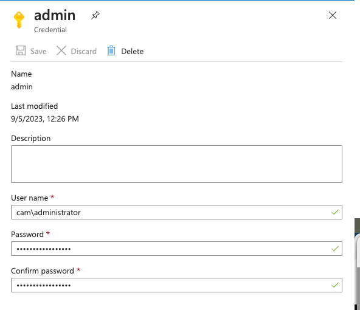
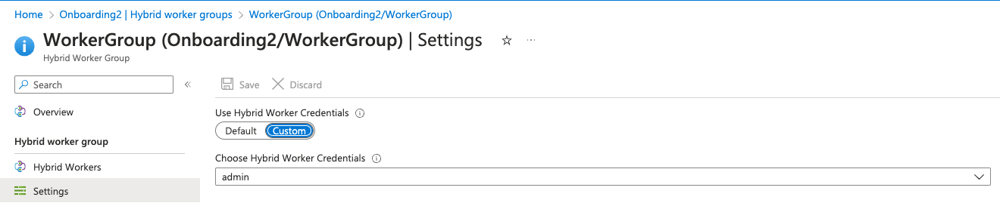
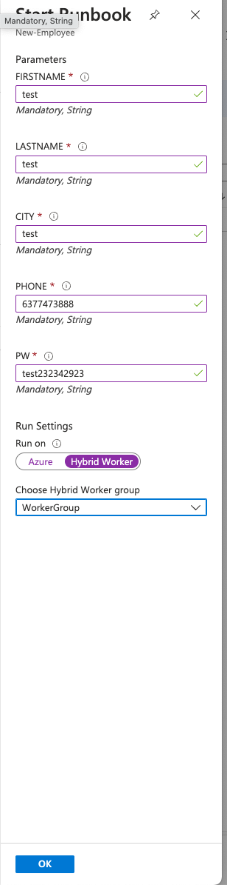

<!-- ABOUT THE PROJECT -->
## About The Project


Handling user accounts, especially in a large company, can be a very repetitive and time-consuming task. As the person responsible for creating all these accounts, I realized that we needed a simpler and faster way to bring new employees onboard. That's why I suggested automating and improving our onboarding process.

Here's why:
* Time Efficiency: By automating and streamlining our user account creation process, we'll be able to save a significant amount of time and effort. This means our new employees can get up and running faster, allowing us to operate more efficiently as a whole.
* Accuracy and Consistency: Automation ensures that every user account is created with precision and consistency. This reduces the chances of errors or discrepancies in user profiles, enhancing our data quality and overall security.
* Resource Savings: Automating repetitive tasks will free up our IT team's valuable time and skills. This can be channeled into more strategic projects, ultimately leading to resource savings and a more productive IT department.


### Built With

This project consisted of the following services

* 


<!-- GETTING STARTED -->
## Getting Started

These steps outline the general approach I took to complete this project. While not providing an in-depth look into each step, they serve as a valuable starting point for anyone looking to initiate a similar project.

### Step 1: Creating an Azure Automation Account

Azure Automation provides a cloud-based automation solution that supports the management of operating system updates and configurations. It ensures consistent control and oversight across both your Azure and non-Azure environments.

Please click [this](https://learn.microsoft.com/en-us/azure/automation/automation-create-standalone-account?tabs=azureportal) on how to create and set up your Azure Automation Account.


### Step 2: Create a Hybrid Worker Group

Azure Automation Runbooks usually run in the Azure cloud, which can limit their access to resources outside Azure or on-premises. To address this, Azure Automation provides the Hybrid Runbook Worker feature, allowing you to run runbooks on the machine hosting the role for local resource interaction. In my scenario, I ran the runbook on our Domain Controller due to our Hybrid Azure setup. These runbooks are managed in Azure Automation and then sent to assigned machines for execution.

Head over to your Automation Account and under "Process Automation", select "Hybrid Worker Groups". Then select "+ Create hybrid worker group". Follow this [guide](https://learn.microsoft.com/en-us/azure/automation/extension-based-hybrid-runbook-worker-install?tabs=windows%2Cbicep-template#create-hybrid-worker-group) below more details. 


When you reach the point of adding a machine, you'll have the option to include Azure virtual machines, Azure Arc-enabled servers, or Azure Arc-enabled VMware vSphere (preview). However, you might observe that there are no devices available for addition to your Hybrid Worker Group. This is because in my scenerio, we need to ensure that Azure Arc Connected Machine Agent is installed on the Domain Controller. Once this is installed, it will then populate on the list of devices to add. Let's go ahead and learn how to install Azure Arc.

### Step 3: Install the Azure Connected Machine agent on Domain Controller to enable Azure Arc

I used the Azure Portal to generate me a script that automates the downloading and installation of the agent and establishes the connection with Azure Arc.

You can follow this [guide](https://learn.microsoft.com/en-us/azure/network-watcher/connection-monitor-connected-machine-agent?tabs=WindowsScript#generate-an-installation-script) which shows you exactly how to retrieve the script and how to install the agent. 

Once an agent has been added, you can proceed to add the newly added worker device.


### Step 4: Create a Runbook

I talked about Runbooks in Step 2. Runbooks are stored and managed in Azure Automation and then delivered to one or more designated Hybrid Worker computers. Please see guide [here](https://learn.microsoft.com/en-us/azure/automation/media/automation-tutorial-runbook-textual/create-powershell-workflow-runbook-options.png) on how to create a new Runbook


This PowerShell script creates a new Active Directory user with specified attributes like name, username, display name, city, phone number, and password, placing the user in the "Users" container of the "cam.local" domain.

   ```powershell
   param (
    [parameter(Mandatory=$true)]
    [string] $firstname,
    [parameter(Mandatory=$true)]
    [string] $lastname,
    [parameter(Mandatory=$true)]
    [string] $city,
    [parameter(Mandatory=$true)]
    [string] $phone,
    [parameter(Mandatory=$true)]
    [string] $pw
)

$displayname = $firstname + " " + $lastname
$upn = "$firstname.$lastname" + "@cam.local"
New-ADUser -Name $displayname `
-SamAccountName "$firstname.$lastname" `
-UserPrincipalName $upn `
-DisplayName $displayname `
-GivenName $firstname `
-Surname $lastname `
-City $city `
-OfficePhone $phone `
-AccountPassword (ConvertTo-SecureString $pw -AsPlainText -Force) `
-Enabled:$true `
-Server cam-dc-01 `
-Path "CN=Users,DC=cam,DC=local"

   
   ```

Include the domain service account in the Automation Account Credentials, making sure to use the format domain\user, as demonstrated below. Navigate to Automation Group > Credentials.



Set up the Hybrid Worker Group to utilize the designated run as account during execution.

Navigate to Hybrid Worker Groups > Settings > Enable Custom for Run As, and then choose the appropriate credential from the dropdown menu.




To diagnose errors like permission issues or syntax problems, you can initiate a test run of your runbook by clicking the 'Start' button.




### Step 5: Create a Microsoft Form

This form serves as the section where either the manager or HR representative will input the new employee's details. While more information is typically needed beyond what's provided here, these fields were included solely for testing purposes.

You can learn how to create a form [here](https://support.microsoft.com/en-us/office/create-a-form-with-microsoft-forms-4ffb64cc-7d5d-402f-b82e-b1d49418fd9d). Ensure that you create this form using the same account you are using to build this application, as it needs to be accessible within your Logic Apps during the next step.

### Step 6: Create a Logic App

Azure Logic Apps is a cloud-based platform that empowers you to design and execute automated workflows effortlessly, even if you have minimal coding skills. Using its intuitive visual designer and a range of prebuilt operations, you can swiftly construct workflows that seamlessly connect and oversee your applications, data, services, and systems.


## Key Takeaways

* You'll come across numerous access/permission issues, view the logs and the error codes that appear to troubleshoot. For example - ensure you have the necessary permissions for your resource groups; otherwise, you won't be able to add role assignments to your automation account.
* In your Logic App, be certain to include a Hybrid Automation Worker Group in the "Create a job" section.
* When working with your runbook script, meticulously check for typos and eliminate any trailing spaces that could potentially lead to runbook failures.
* If you intend to create a user in the default "user" Organizational Unit (OU), the path should be specified as: CN="Users".

## Next Steps and Future Improvements

* Opt for triggering the Logic App via email, aligning with our current organizational practice.
* Instead of incorporating a "password" entry field in the Forms, explore a secure solution for automatic password generation to mitigate potential security concerns.
* Integrate automation for adding users to groups based on their selected department, ensuring that the appropriate security groups are assigned accordingly.
* Implement an automated email generation process to notify employees and other stakeholders once their accounts have been successfully created.
* Use Infrastructure-as-Code (IaC) such as Terraform for efficient application development.