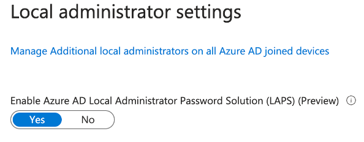
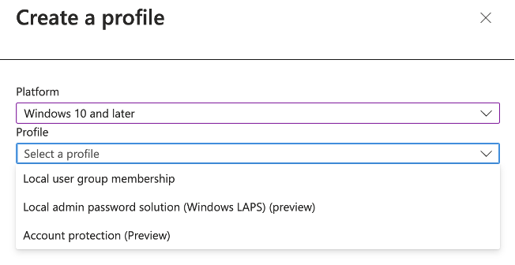
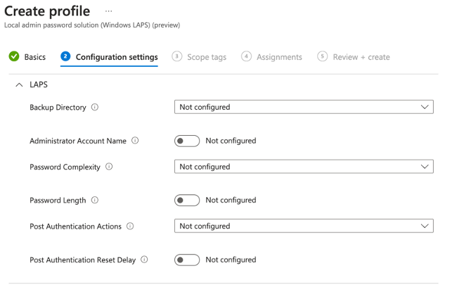

<!-- ABOUT THE PROJECT -->
## About The Project

The Windows Local Administrator Password Solution (LAPS) is a Microsoft-provided tool that empowers you to effectively control and regularly update local administrator passwords on Windows devices. Typically, local administrator passwords are identical across all Windows devices by default, presenting a potential security vulnerability. I recognized the need to enhance system security, which led me to initiate the project for implementing Microsoft LAPS within our organization.

LAPS addresses this issue by automatically generating distinct passwords for each device and securing them in Azure Active Directory. Notably, Windows LAPS does not require any specific licensing, as it is accessible to any organization with an Azure AD Free or higher license.

Windows LAPS is now available on the following OS platforms with the specified update or later installed:

* Windows 11 22H2 - April 11 2023 Update
* Windows 11 21H2 - April 11 2023 Update
* Windows 10 - April 11 2023 Update
* Windows Server 2022 - April 11 2023 Update
* Windows Server 2019 - April 11 2023 Update

## Implementation Plan

With Microsoft Intune, I can leverage Endpoint Security to implement LAPS (Local Administrator Password Solution) within our organization. We'll establish a policy containing all the recommended configurations to enhance compliance and bolster security.

### Built With

This project consisted of the following services

<!-- GETTING STARTED -->
## Getting Started

These steps outline the general approach I took to complete this project. While not providing an in-depth look into each step, they serve as a valuable starting point for anyone looking to initiate a similar project.

### Step 1: Enable Windows LAPS via Intune

1.	Sign in to Azure Active Directory.
2.	Navigate to Devices > Device Settings.
3.	Activate the "Enable Azure AD Local Administrator Password Solution (LAPS)" option by switching it to "Yes."
4.	Ensure you save the changes by clicking the "Save" button.

### Step 2: Create LAPS Policy

1.	Sign in to the Microsoft Intune admin center.
2.	Navigate to "Endpoint Security" and select "Account Protection."
3.	Click the "+ Create Policy" button.
4.	Choose "Windows 10 and Later" as the platform.
5.	Select "Local Administrator Password Solution (Windows LAPS)" as the profile.
6.	Finally, click "Create" to initiate the policy creation process.

**Basics Tab**

On the basics tab, provide a Name and Description of the Windows LAPS Profile.

1.	Name: Windows LAPS 
2.	Description: This is a Windows LAPS profile for devices which are joined to Intune
3.	Azure AD Organization and Enrolled into MS Intune

**Configuration Tab**

In this section, you will define your LAPS policy settings. Here are the settings and their recommended configurations:

1.	Backup Directory: Choose to back up the password to Azure AD only.
2.	Password Age (Days): Enable and set it to a value between 7 and 365 days. If not enabled, it defaults to 30 days.
3.	Administrator Account Name: You can manage a custom local admin account that you've previously created on all your organization's devices. If not specified, the default built-in local administrator account will be located by its well-known SID, even if it's been renamed, and managed by Intune. Note that Windows LAPS does not create the account itself.
4.	Password Complexity: The recommended setting is "Large letters + small letters + numbers + special characters."
5.	Password Length: Configure the password length, with a minimum value of 8 and a maximum value of 64. If not enabled, it defaults to a length of 14 characters. You can set a specific length.
6.	Post Authentication Actions: If you wish to rotate the local admin password after every use, you can select one of the options from the dropdown. When using this option, ensure you set a Post Authentication Reset delay to allow enough time for IT members to complete troubleshooting before any Post Authentication action is taken, as per your configuration. If not configured, the default is "Reset password + log off."
a.	Reset password: Resets the password and backs up the new password to Azure AD every time someone authenticates using the local admin account.
b.	Reset password and log off: Resets the password, backs up the new password to Azure AD, and logs off the account every time someone authenticates using the local admin account.
c.	Reset password and reboot: Resets the password, backs up the new password to Azure AD, and reboots the device every time someone authenticates using the local admin account.
7.	Post Authentication Delay: If you don't configure this option, the default is set to 24 hours. Use this setting to specify the amount of time to wait before taking Post Authentication actions. To disable Post Authentication actions, set the Post Authentication Delay value to 0. The minimum value is 0, and the maximum is 24 for this setting.

**Assignments Tab**

1.	Azure AD Security Group Creation: Begin by creating an Azure AD Security group that includes the users or devices on which this device configuration profile is intended to be deployed. It's important to note that if you include users in this group, the Windows LAPS policy will be applied to all devices associated with those users that are both joined to Azure AD and enrolled into Intune. If your intention is to deploy the policy to specific devices, it is advisable to add those devices directly to the Azure AD security group, rather than including users.
2.	Deploying to All End User Devices: If your objective is to deploy this policy to all end user devices, you can simplify the process by selecting "+ Add all devices" to target all devices that are enrolled into Intune.

**Review + Create**

Navigate to the "Review + Create" tab, where you can review the profile settings. Once you've reviewed the profile and ensured it aligns with your requirements, click on the "Create" button. Upon clicking the "Create" button, the Windows LAPS policy will be generated and automatically assigned to the designated devices.

## Key Takeaways

* More information regarding LAPS via Intune can be found [here](https://learn.microsoft.com/en-us/mem/intune/protect/windows-laps-overview).
* To manually rotate password. Go to Intune > Devices > Click Device > "Rotate Local Admin Password". The password can then be viewed on the left tab "Local Admin Password".
* If you do decide to manually rotate the password, you will need to manually force sync that specific device by going doing the following: 
1. Go to Settings -> click on Accounts -> click on Access work or school.
2. Click on your Connected Organization. For example: Connected to "your Organization" Azure AD.
3. Click on Info Button and click "Sync"
* I ran numerous testing to ensure that policies were being put into place. I created multiple VMs on VMWare to replicate our production environment. **Remember to test any changes thoroughly on non-production systems before implementing them in a production environment.**

## Next Steps and Future Improvements

* None at the moment.