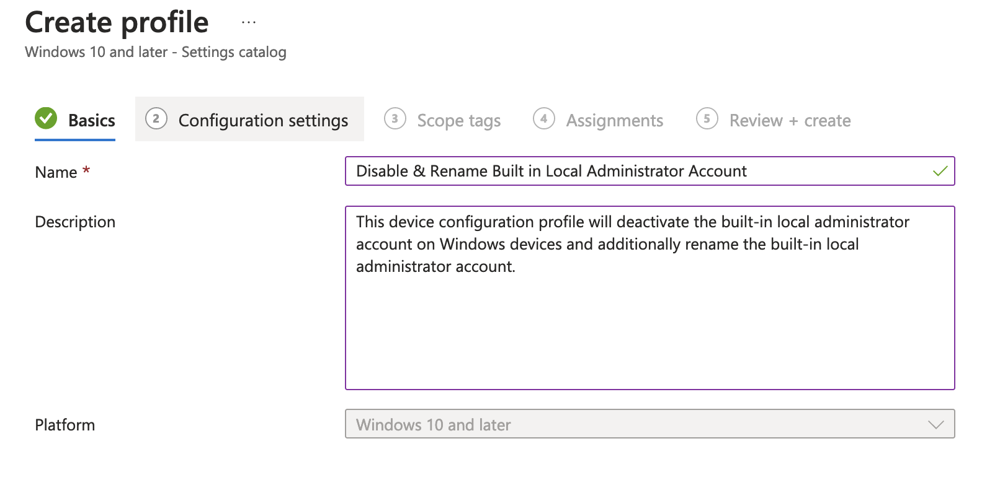
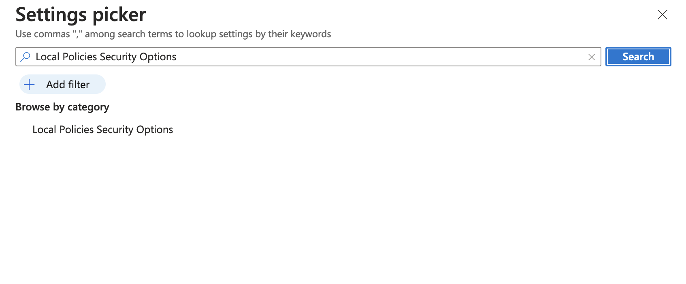
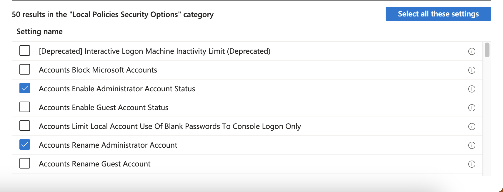
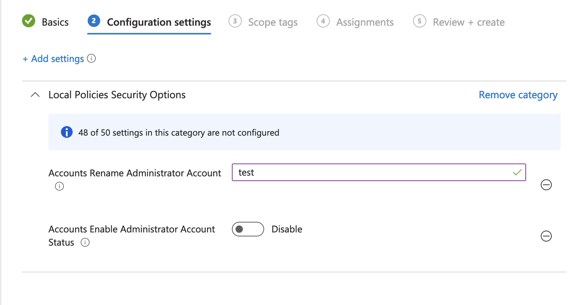

<!-- ABOUT THE PROJECT -->
## About The Project

The built-in local administrator account is a well-known account name that attackers will target. It is recommended to choose another name for this account, and to avoid names that denote administrative or elevated access accounts.

The built-in Guest account allows unauthenticated network users to log on as Guest with no password. These unauthorized users could access any resources that are accessible to the Guest account over the network. This capability means that any network shares with permissions that allow access to the Guest account, the Guests group, or the Everyone group will be accessible over the network, which could lead to the exposure or corruption of data.

For security and compliance purposes, I had to find a solution to automatically disable and rename the built-in Local Administrator and Guest Accounts.

We currently utilize Intune to manage our devices and we can use Configuration Profiles to do exactly this. Disabling and renaming the accounts on every single device is time consuming and unneccesary. 

## Implementation Plan

Microsoft Intune allows us to efficiently manage our organization's settings. We will create two Configuration Policies: one for Administrators and one for Guests. These policies will include all the recommended configurations to enhance compliance and bolster security.

In this Implementation Plan, I will focus solely on the "Disable & Rename Built-in Local Administrator Account" configuration profile, as the approach for Guests remains the same.

### Built With

This project consisted of the following services

<!-- GETTING STARTED -->
## Getting Started

### Step 1: Create a Configuration Profile

Let's deactivate the built-in Administrator account on a Windows 10 or Windows 11 device through Intune. We'll achieve this by establishing a Device configuration profile and configuring the necessary settings from the Settings Catalog.

1.	Login on Microsoft Intune admin center
2. Go to Devices > Configuration profiles
3. Click on + Create Profile
4. Select Platform as Windows 10 and later
5. Profile type: Settings Catalog

**Basics Tab**

1. Name – Disable & Rename Built in Local Administrator Account
2. Description – This device configuration profile will deactivate the built-in local administrator account on Windows devices and additionally rename the built-in local administrator account.

**Configuration Tab**

1. Click "Add Settings"
2. Search for "Local Policies Security Options"

3. Click "Local Policies Security Options" and a window will expand on the bottom
4. Check the policy settings: "Accounts Enable Administrator Account status“ & "Accounts Rename Administrator Account". For Guests, check the policy settings: "Accounts Enable Guest Account status“ & "Accounts Rename Guest Account"

5. Fill in the "Accounts Rename Administrator Account" field with a desired name. 
6. Make sure "Accounts Enable Administrator Account Status" is toggled to "Disable"

7. Click Next

**Assignments Tab**

As this is a device-based policy, it must be scoped to target devices specifically. To assign this policy to a select group of devices, you can create an Azure AD security group and assign this device configuration profile to that group exclusively.

To deploy it to all end-user devices, you can simply select "+ Add all devices" to target all devices enrolled in Intune.

**Review & Create**

On the "Review + Create" tab, please review the profile settings and then click on "Create." This action will generate the deployment profile for enabling and renaming the built-in local administrator account on the specified target devices.

## Key Takeaways

* If you want to manually force sync the changes, please do the following: 
1. Go to Settings -> click on Accounts -> click on Access work or school.
2. Click on your Connected Organization. For example: Connected to "your Organization" Azure AD.
3. Click on Info Button and click "Sync"
* I ran numerous testing to ensure that policies were being put into place. I created multiple VMs on VMWare to replicate our production environment. **Remember to test any changes thoroughly on non-production systems before implementing them in a production environment.**

## Next Steps and Future Improvements

* None at the moment.